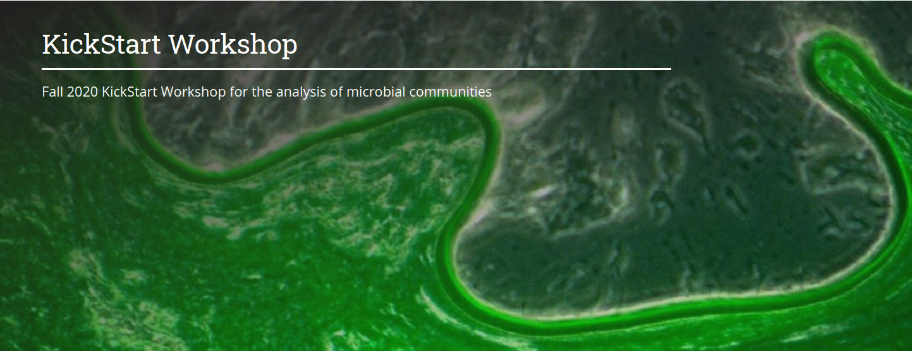

# KickStart-Workshop-2020
Materials for the Fall 2020 KickStart Workshop

## Details
August 9 - 13th, 2021
Time: 1pm - 5pm each day
Zoom (link in email)

### Tutors:
- Laura Weyrich  
- David Koslicki  
- Emily Davenport  
- Sharifa Crandall  
- Estelle Couradeau  
- Darrell Cockburn  
- Erika Ganda

## Requirements
A PSU email and access to Penn State’s Roar system is required prior to the workshop. You can do this by going to https://accounts.aci.ics.psu.edu, and entering your information.  For the purposes of this workshop, please list Laura Weyrich (lsw132) as your account sponsor and put "2021 Microbiome Center Summer Workshop" into the "Research Description" field of the account request form. 

## Schedule
- Day 1 (OPTIONAL): [Unix Basics and Intro to Programming](/Day1-UnixBasics) - Emily Davenport  
- Day 2: Basics of Microbiome Analysis - From Planning to Sequencing   -All Tutors
- Day 3: Amplicon Data Analysis in R - Sharifa Crandall and Erika Ganda
- Day 4: Amplicon Data Analysis in QIIME2 - Erika Ganda and Laura Weyrich
- Day 5: Shotgun data analysis (binning and assembly) - David Koslicki