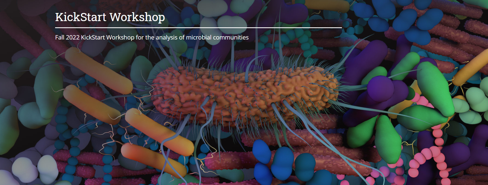

# KickStart-Workshop-2021
Materials for the Fall 2021 KickStart Workshop

## Details
August 1 - 5th, 2022  
Time: 1pm - 5pm each day  
In person in [Althouse's Blue Box](https://tlt.psu.edu/bluebox/)

### Tutors:
- Laura Weyrich		lsw132@psu.edu  
- David Koslicki		dmk333@psu.edu
- Emily Davenport	exd44@psu.edu  
- Sharifa Crandall	sgcrandall@psu.edu  
- Estelle Couradeau	efc5279@psu.edu 
- Darrell Cockburn	dwc30@psu.edu  
- Erika Ganda		ganda@psu.edu

## Requirements
A PSU email and access to Penn State’s Roar system is required prior to the workshop. You can do this by going to https://accounts.aci.ics.psu.edu, and entering your information.  For the purposes of this workshop, please list Laura Weyrich (lsw132) as your account sponsor and put "2022 Microbiome Center Summer Workshop" into the "Research Description" field of the account request form. 

## Schedule
- Day 1 (OPTIONAL): [Unix Basics and Intro to Programming](/Day1-UnixBasics) - Emily Davenport  
- Day 2: [Basics of Microbiome Analysis - From Planning to Sequencing](/Day2-MicrobiomeAnalysisBasics) - Organizing Committee
- Day 3: [Amplicon Data Analysis in R](/Day3-AmpliconR) - Sharifa Crandall 
- Day 4: [Amplicon Data Analysis in QIIME2](/Day_4_QIIME2) - Erika Ganda and Laura Weyrich
- Day 5: [Shotgun data analysis (assembly, binning, and profiling)](Day5-Shotgun/README.md) - David Koslicki
